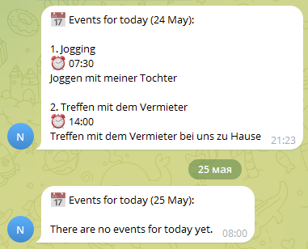

# 📅 Google Calendar to Telegram Bot

A lightweight Python bot that fetches today's events from Google Calendar and sends them as a daily digest to a Telegram chat. Designed for automated execution via Windows Task Scheduler or cron.

## ✨ Features

- 🔐 **Google Calendar API integration** using service account authentication
- 🤖 **Telegram Bot API** for message delivery
- ⏰ **Automatic daily execution** via scheduler/cron
- 📦 **Self-contained** - no database required


## Screenshots



## 🚀 Quick Start

### Prerequisites

- **Python 3.8+** installed
- **Google Cloud Project** with Calendar API enabled
- **Telegram Bot Token** from [@BotFather](https://t.me/botfather)
- **Google Service Account** with access to your calendar

### Installation

1. **Clone or download the project**

2. **Create and activate virtual environment**

   Windows:
   ```batch
   python -m venv .venv
   .venv\Scripts\activate

### Configure environment variables

Create .env file in the project root:

GOOGLE_CALENDAR_ID=your-calendar@group.calendar.google.com
GOOGLE_CREDENTIALS_FILE=credentials.json
TELEGRAM_BOT_TOKEN=1234567890:ABCdefGHIjklMNOpqrsTUVwxyz
TELEGRAM_CHAT_ID=123456789


### Add Google credentials

Place your credentials.json (service account key) in the project root

Share calendar with service account

Copy the service account email from credentials.json and share your Google Calendar with it (view permissions)


### Telegram Bot Setup

Open Telegram and search for @BotFather

Send /newbot and follow instructions

Copy the provided bot token

Find your chat ID:

Send a message to your bot

Visit: https://api.telegram.org/bot<YOUR_TOKEN>/getUpdates

Look for "chat":{"id":...}

### Google Calendar Setup
Enable Google Calendar API:

Go to Google Cloud Console

Create a new project or select existing

Enable Google Calendar API

Create Service Account:

Navigate to IAM & Admin → Service Accounts

Create new service account

Generate JSON key and download as credentials.json

Share your calendar:

Open Google Calendar

Go to calendar settings

Add the service account email (found in credentials.json)

Set permission: "See all event details"

📄 License
MIT License - feel free to use and modify

🤝 Contributing
Feel free to submit issues and enhancement requests!

